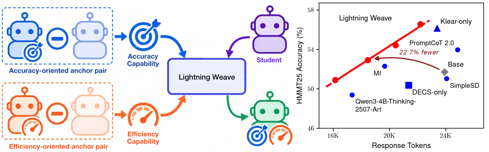
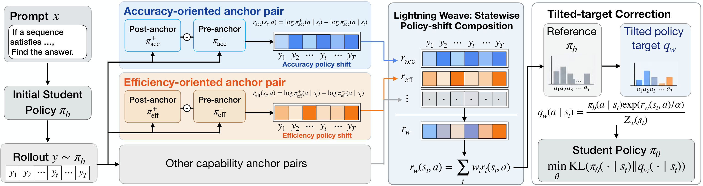
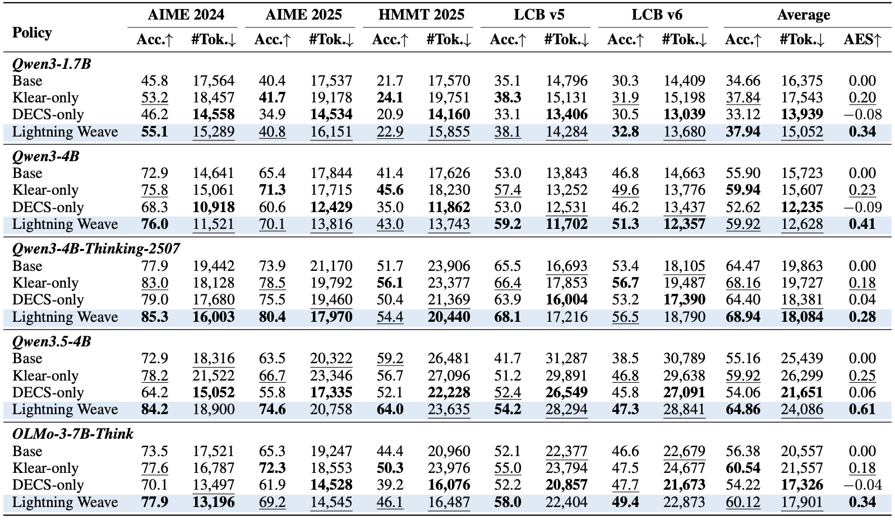

# Lightning Weave: Improving the Accuracy-Efficiency Frontier of Reasoning Models through Capability Composition

<div align="center">
  <a href="https://arxiv.org/abs/2609.14708"></a> &ensp;
  <a href="https://huggingface.co/papers/2609.14708"></a>
</div>

<p align="center">
  
</p>

## 💡 Introduction

Lightning Weave is a new post-training framework that improves reasoning accuracy and inference efficiency by composing capabilities learned by independently post-trained models into a single student. On Qwen3.5-4B, it raises HMMT 2025 accuracy from **59.2% to 64.0% with 10.7% fewer response tokens**, and LiveCodeBench v5 accuracy from **41.7% to 54.2% with 9.6% fewer response tokens**.

Jointly improving accuracy and efficiency is challenging because the two objectives can favor different reasoning behaviors. Independently post-trained models already offer distinct strengths in each dimension. Lightning Weave brings these strengths together through two core components:

- **Capability Composition:** Each capability is represented by the policy shift from a pre-anchor to its post-trained specialist. Lightning Weave combines these shifts at shared student token states, with adjustable anchor weights controlling the accuracy–efficiency frontier.
- **Tilted-Target Distillation:** The composed shift tilts the initial student policy into an explicit learning target. Anchor scores are precomputed once on student rollouts, so subsequent training runs only the student without serving multiple live anchor models.

<p align="center">
  <a href="assets/overview.pdf"></a>
</p>

Lightning Weave is evaluated across Qwen3-1.7B, Qwen3-4B, Qwen3-4B-Thinking-2507, OLMo-3-7B-Think, and Qwen3.5-4B on math reasoning (AIME 2024, AIME 2025, HMMT 2025) and code generation (LiveCodeBench v5/v6). Across these students, it **improves average accuracy while reducing average response tokens** relative to the base model, and achieves the **highest Accuracy–Efficiency Score (AES)** among the compared policies.

<p align="center">
  
</p>

### News

- \[2026.09\] We release the development code for Lightning Weave.
- \[2026.09\] We release the [paper](https://arxiv.org/abs/2609.14708) on arXiv.

### Contents

+ [Installation](#installation)
+ [Quick Reproduction (Qwen3-4B)](#quick-reproduction-qwen3-4b)
+ [Code Training](#code-training)
+ [Single-Anchor and Multi-Anchor Settings](#single-anchor-and-multi-anchor-settings)
+ [Model Configurations](#model-configurations)
+ [Evaluation](#evaluation)
+ [Hardware Requirements](#hardware-requirements)
+ [Project Structure](#project-structure)
+ [Contact](#contact)
+ [License](#license)
+ [BibTeX](#bibtex)

## Installation

```bash
git clone https://github.com/jet-ai-projects/Lightning-Weave.git
cd Lightning-Weave
```

The pipeline uses separate environments to avoid dependency conflicts:

### Environment 1: `curation` (Step 0–3 — data preparation, rollout collection, and anchor scoring)

```bash
conda create -n curation python=3.10 -y
conda activate curation
python -m pip install -e '.[curation]'
```

### Environment 2: Docker container (Step 4–6 — checkpoint conversion and Lightning Weave training)

Launch the Docker container on a GPU machine:

```bash
bash run_docker.sh
```

Inside the container:

```bash
python -m pip install -e .
```

The default image provides the Qwen3 training stack. For a user-managed environment, see `requirements-train.txt` and install compatible PyTorch, Megatron-LM, Transformer Engine, and SGLang builds. Set `MEGATRON_PATH` for a Megatron-LM source checkout. Qwen3.5 requires newer model and kernel dependencies; see [training details](docs/training.md).

### Environment 3: `evaluation` (math and code evaluation)

```bash
conda create -n evaluation python=3.10 -y
conda activate evaluation
python -m pip install -r requirements-eval.txt
```

For LiveCodeBench, install its upstream package in a compatible evaluation environment as described in [evaluation details](docs/evaluation.md).

## Quick Reproduction (Qwen3-4B)

Below is the Qwen3-4B example with Klear and DECS anchor pairs. All commands are run from the `Lightning-Weave/` root directory; intermediate outputs are stored under `outputs/` and `checkpoints/`.

```
Lightning-Weave/
├── outputs/qwen3-4b-math/
│   ├── prompts.parquet          # Step 0 output
│   ├── rollouts/               # Step 1 output
│   ├── anchors/                # Step 2 output
│   │   ├── klear/final/
│   │   └── decs/final/
│   └── composed/               # Step 3 output
└── checkpoints/
    ├── qwen3-4b-initial/        # Step 4 output
    ├── qwen3-4b-klear-decs/     # Step 5 output
    └── qwen3-4b-klear-decs-hf/  # Step 6 output
```

The example uses the following anchor pairs:

| Capability | Post-anchor | Pre-anchor |
| --- | --- | --- |
| Accuracy | `Kwai-Klear/Klear-Reasoner-8B` | `Qwen/Qwen3-8B-Base` |
| Efficiency | `pixas/DECS_1.5B` | `deepseek-ai/DeepSeek-R1-Distill-Qwen-1.5B` |

### Step 0: Download Checkpoints and Prepare Prompts

> Environment: **curation** (`conda activate curation`)

Use local immutable snapshots to record the checkpoints used for each run.
Model downloads and caches are not committed to this repository.

```bash
export STUDENT_MODEL="$(hf download Qwen/Qwen3-4B)"
export KLEAR_POST_MODEL="$(hf download Kwai-Klear/Klear-Reasoner-8B)"
export KLEAR_PRE_MODEL="$(hf download Qwen/Qwen3-8B-Base)"
export DECS_POST_MODEL="$(hf download pixas/DECS_1.5B)"
export DECS_PRE_MODEL="$(hf download deepseek-ai/DeepSeek-R1-Distill-Qwen-1.5B)"
export TASK=math
export RUN_DIR="$PWD/outputs/qwen3-4b-math"

hf download Skywork/Skywork-OR1-RL-Data \
  data/math-00000-of-00001.parquet \
  --repo-type dataset --local-dir data/skywork-or1

SOURCE_INPUT="$PWD/data/skywork-or1/data/math-00000-of-00001.parquet" \
  bash scripts/prepare_data.sh
```

### Step 1: Collect Student Rollouts

> Environment: **curation** (`conda activate curation`), GPU node

```bash
bash scripts/collect_rollouts.sh
```

By default this collects four responses for each of 3,200 prompts, with a
2,048-token response cap and a shared Top-K candidate support of 16. Every
anchor must score **this same cache**, not separately generated rollouts.
Use a fresh `RUN_DIR` when changing models or generation settings; the scripts
do not audit or resume an existing run.

### Step 2: Precompute Anchor Log-Probabilities

> Environment: **curation** (`conda activate curation`), GPU node

```bash
ANCHOR_NAME=klear bash scripts/score_anchors.sh
ANCHOR_NAME=decs bash scripts/score_anchors.sh
```

These commands load each post-anchor, pre-anchor, and student reference in
separate processes. They do not require serving all anchor models simultaneously.
The resulting manifests record model metadata and shard checksums for the
training loader.

### Step 3: Compose the Target

> Environment: **curation** (`conda activate curation`), CPU only

```bash
bash scripts/compose_targets.sh
```

The default raw coefficients are `KLEAR_WEIGHT=1.0` and `DECS_WEIGHT=1.0`.
The joint signal is

```text
delta = sum_j weight_j * (log p_post_j - log p_pre_j)
q     ∝ p_initial_student * exp(delta / alpha)
```

`ALPHA=1.25` is paired with these coefficients in this example. Weights are
not normalized automatically. Scaling every weight and alpha by the same
positive factor preserves the target, but scaling just the weights does not.
See [data preparation and composition](docs/data_pipeline.md) for the five-point
sweep and the cross-tokenizer mask behavior.

### Step 4: Convert the Initial Checkpoint to Megatron Format

> Environment: **container** (`bash run_docker.sh`, with `pip install -e .`)

Set `STUDENT_MODEL` to the same downloaded snapshot used in Step 0:

```bash
export MODEL_TYPE=qwen3-4B
export NUM_GPUS=8
export LOAD_DIR="$PWD/checkpoints/qwen3-4b-initial"

OUTPUT_DIR="$LOAD_DIR" bash scripts/convert_checkpoint.sh to-megatron
```

### Step 5: Lightning Weave Training

> Environment: **container** (`bash run_docker.sh`, with `pip install -e .`)

Train the student using the composed target cache. No live anchor server is required.

```bash
export RUN_DIR="$PWD/outputs/qwen3-4b-math"
export SAVE_DIR="$PWD/checkpoints/qwen3-4b-klear-decs"
export DATA_DIR="$RUN_DIR/composed"
export ALPHA=1.25

bash scripts/train.sh --num-rollout 100
```

Training uses Megatron + Ray with the slime framework. With the default rollout batch size of 256 and global batch size of 64, `--num-rollout 100` consumes 100 cached batches and performs **400 optimizer updates**. Use `--optimizer-steps 100` for exactly 100 optimizer updates. The default composed dataset contains 12,800 trajectories repeated twice.

Use `bash scripts/train.sh --dry-run` to inspect the command. See [training details](docs/training.md) for model dependencies, checkpoint conventions, and the current validation status.

### Step 6: Convert Megatron Checkpoint to HuggingFace Format

> Environment: **container** (`bash run_docker.sh`)

Convert a completed training checkpoint to HuggingFace format for evaluation:

```bash
INPUT_DIR="$SAVE_DIR/iter_0000099" \
OUTPUT_DIR="$PWD/checkpoints/qwen3-4b-klear-decs-hf" \
  bash scripts/convert_checkpoint.sh to-hf
```

`INPUT_DIR` points to an iteration directory. The 100-batch Megatron example ends at `iter_0000099`; FSDP uses `iter_0000100` for the equivalent run.

## Code Training

Use `Kwai-Klear/KlearReasoner-CodeSub-15K` with `TASK=code`, in a separate
`RUN_DIR`. The same collection, scoring, composition, and training stages apply.
Training still uses a 2,048-token rollout cap; it does not use the 40,960-token
evaluation budget.

The code preparer removes benchmark overlaps and duplicate prompts before
selection. Follow [the CodeSub-15K recipe](docs/data_pipeline.md#code-prompts)
to download the pinned dataset and create its LiveCodeBench exclusion lock.

## Single-Anchor and Multi-Anchor Settings

For a single anchor, train directly on its sealed directory, for example
`DATA_DIR="$RUN_DIR/anchors/klear/final"`. Use an explicit alpha appropriate
to that setting and a batch budget that fits the data (the unrepeated
12,800-row cache supports 50 batches of 256). `data_curation/repeat_sealed_direct_opd.py`
can prepare a repeated cache for a longer run.
Do not obtain a single-anchor control by setting one coefficient
to zero in a multi-anchor cache: that cache still intersects the supplied
anchors' token-validity masks.

For more anchors, score each new post/pre pair on the existing rollout cache
and provide additional `--anchor-manifest`, `--anchor-name`, and
`--anchor-weight` arguments to `scripts/compose_targets.sh`.

See [data preparation and composition](docs/data_pipeline.md) for the weighting convention and [training details](docs/training.md) for the cached-support loss.

## Model Configurations

Set `MODEL_TYPE` to select the student architecture:

| Student | `MODEL_TYPE` | Training Backend |
|---------|--------------|------------------|
| Qwen3-1.7B | `qwen3-1.7B` | Megatron |
| Qwen3-4B | `qwen3-4B` | Megatron |
| Qwen3-4B-Thinking-2507 | `qwen3-4B-Thinking-2507` | Megatron |
| Qwen3.5-4B | `qwen3.5-4B` | Megatron |
| OLMo-3-7B-Think | `olmo3-7b-think` | FSDP |

Each student requires its own rollout and anchor-score cache. Qwen3.5 uses the included model adapter and additional kernel dependencies. OLMo loads its HuggingFace checkpoint directly with FSDP and does not require Step 4. See [training details](docs/training.md) for these configurations.

## Evaluation

Evaluate exported Hugging Face checkpoints separately from training:

| Domain | Benchmarks | Response cap | Repetitions per problem |
| --- | --- | --- | --- |
| Math | AIME 2024, AIME 2025, HMMT February 2025 | 32,768 | 64 |
| Code | LiveCodeBench v5, v6 | 40,960 | 4 |

Accuracy is mean sample correctness, not the probability that at least one
sample passes. Both domains also report mean response tokens. See
[evaluation](docs/evaluation.md) for commands, task configurations, and metric
aggregation. Execute generated code only inside an isolated environment.

## Hardware Requirements

The example scripts use the following resource configurations:

| Stage | Configuration |
|-------|---------------|
| Step 0: Prompt Preparation | CPU |
| Step 1: Student Rollouts | GPU; configurable with `TP_SIZE` |
| Step 2: Anchor Scoring | One GPU per invocation; models loaded sequentially |
| Step 3: Target Composition | CPU |
| Step 4, 6: Checkpoint Conversion | Training environment |
| Step 5: Lightning Weave Training | 1 node × 8 GPUs by default; configurable with `NUM_GPUS` |

Lightning Weave training uses all configured GPUs for the student since no live anchor server is needed. GPU memory requirements depend on model size, precision, and sequence length.

## Project Structure

```
assets/                  Paper figures
configs/                 Training configurations
  lightning_weave/       Lightning Weave training launcher
  models/                Megatron model architecture definitions
scripts/                 Pipeline step scripts
data_curation/           Data processing (prompts, rollouts, scoring, composition)
evaluation/              Math and code evaluation
slime/                   Training framework (Megatron + Ray + SGLang, FSDP)
slime_plugins/           Framework plugins
tools/                   Checkpoint conversion
tests/                   Regression tests
docs/                    Data, training, and evaluation details
train.py                 Training entry point
data/                    Downloaded datasets (generated, gitignored)
outputs/                 Intermediate data (generated, gitignored)
checkpoints/             Model checkpoints (generated, gitignored)
```

## Acknowledgements

This codebase is built upon [Lightning OPD](https://github.com/jet-ai-projects/Lightning-OPD) and [slime](https://github.com/THUDM/slime). We thank the developers of these projects for their excellent work.

## Contact

+ [Yecheng Wu](mailto:wyc557@mit.edu)
+ [Song Han](https://hanlab.mit.edu/songhan)
+ [Han Cai](http://hancai.ai/)

## Contributing

This project is currently not accepting contributions.

## License

+ [Code](./LICENSE)
+ [Third-Party Notices](./THIRD_PARTY_NOTICES.md)

## BibTeX

```bibtex
@article{wu2026lightningweave,
  title={Lightning Weave: Improving the Accuracy-Efficiency Frontier of Reasoning Models through Capability Composition},
  author={Wu, Yecheng and Han, Song and Cai, Han},
  journal={arXiv preprint arXiv:2609.14708},
  year={2026}
}
```
